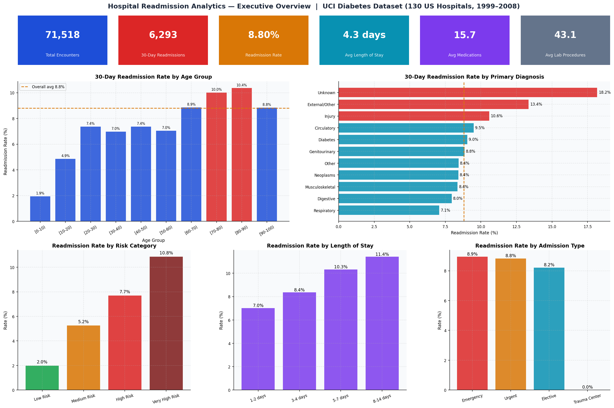
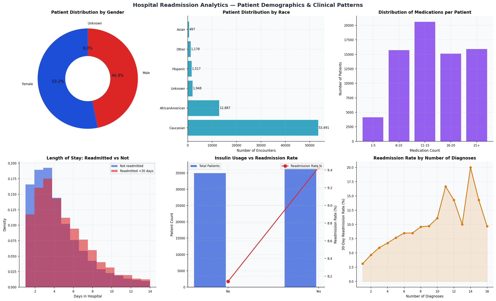
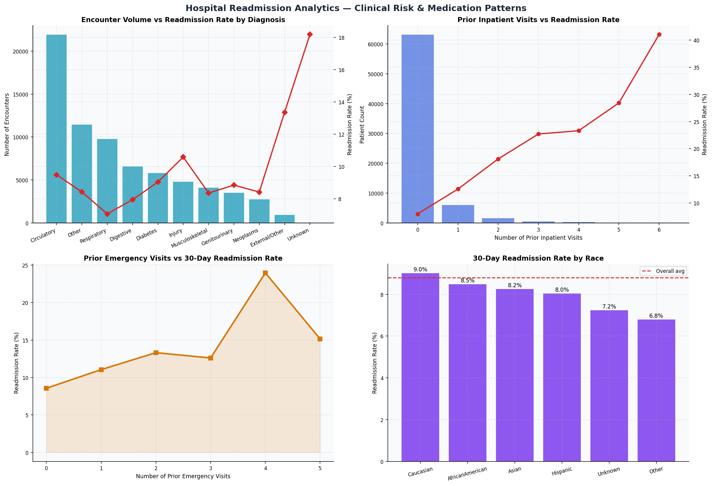

# Hospital Readmission Analytics

**Python · SQL · Pandas · Matplotlib · ETL · EDA · Risk Stratification**


## Overview

End-to-end analytics project analysing 30-day hospital readmissions for diabetes
patients using real clinical data from 130 US hospitals (1999–2008).
101,766 actual patient encounters from the UCI Machine Learning Repository.

**Dataset:** [UCI Diabetes 130-US Hospitals — Kaggle](https://www.kaggle.com/datasets/brandao/diabetes)

## Dashboard Preview





## Key Findings

- 30-day readmission rate: **8.80%** across 71,518 encounters
- Patients aged **70-90** have highest readmission rates (10%+)
- **Very High Risk** patients: 10.85% vs 1.98% for Low Risk
- Longer stays (8-14 days): **11.41% readmission rate**

- Prior inpatient visits are the strongest predictor of readmission

## Project Structure

```
hospital-readmission-analytics/
├── 01_data/
│   ├── raw/                       Real UCI dataset — 101,766 rows
│   └── processed/                 Cleaned analytics-ready tables
├── 02_notebooks/
│   ├── 01_data_cleaning.py        ETL pipeline — cleaning and validation
│   ├── 02_eda_analysis.py         EDA and dashboard chart generation
│   └── 03_sql_analysis.py         Runs SQL queries, saves outputs to CSV
├── 03_sql/
│   └── analysis_queries.sql       6 SQL queries — reference file
│                                  (CTEs, window functions, aggregations)
├── 04_dashboard_exports/          Dashboard charts (Python matplotlib)
├── requirements.txt
└── README.md
```

## How to Run

```bash
# Install dependencies
pip3 install pandas numpy matplotlib

# Step 1 — Clean and validate raw data
python3 02_notebooks/01_data_cleaning.py

# Step 2 — Run EDA and generate dashboard charts
python3 02_notebooks/02_eda_analysis.py

# Step 3 — Run SQL business analysis queries
python3 02_notebooks/03_sql_analysis.py

# View dashboard charts
open 04_dashboard_exports/01_executive_overview.png
```

**Note:** `03_sql_analysis.py` executes all 6 queries from `03_sql/analysis_queries.sql`
using SQLite (built into Python — no database server needed). The SQL reference
file can also be run directly in any SQL environment such as DB Browser for SQLite,
DBeaver, or any cloud data warehouse.

## SQL Queries Included

| Query | Business Question |
|-------|------------------|
| Q1 | Readmission rate by age group |
| Q2 | Risk stratification with RANK window function |
| Q3 | Diagnosis category analysis with % of total |
| Q4 | Admission type comparison using HAVING |
| Q5 | High-risk patient profile — multi-condition filter |
| Q6 | Length of stay impact using SUM OVER window function |

## Skills Demonstrated

`Python` `Pandas` `NumPy` `Matplotlib` `SQL` `SQLite`
`CTEs` `Window Functions` `ETL Pipeline` `Data Cleaning`
`Data Validation` `EDA` `Risk Stratification` `KPI Analysis`
`Healthcare Analytics` `Statistical Analysis` `Business Insights`

## Author

**Hely Shah** — MS Computer Science, Hofstra University, May 2026
Data Analyst · Python · SQL · Power BI · Tableau · Snowflake

LinkedIn: [linkedin.com/in/hely-shah](https://www.linkedin.com/in/hely-shah-53432b20a/)
GitHub: [github.com/Hely-shah](https://github.com/Hely-shah)
**Hely Shah** — MS Computer Science, Hofstra University, May 2026
